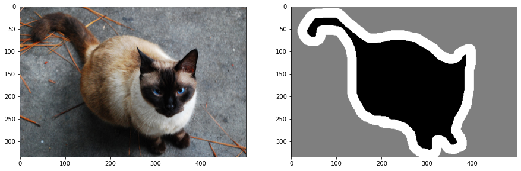
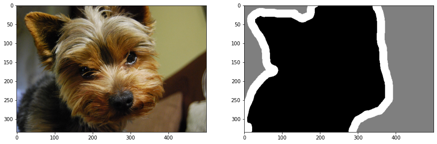
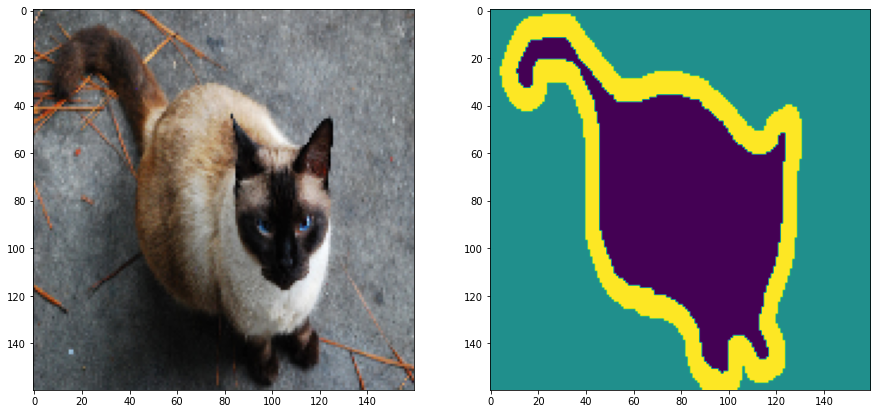
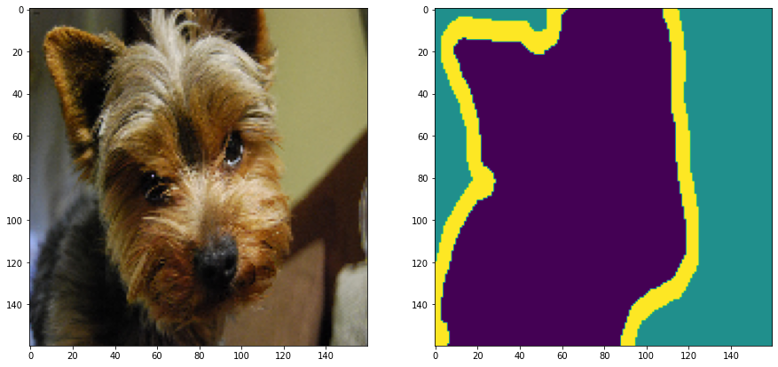
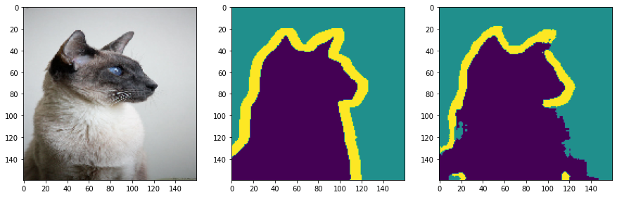

# IDEC Image Segmentation

Advanced Image Segmentation Lecture based on Deep Learning in **한국과학기술원 반도체설계교육센터 [(KAIST IDEC)](https://www.idec.or.kr/)**

**Pneumonia Data Image Segmentation with U-Net**
 In 2021 Advanced Image Segmentation Lecture with KAIST IDEC

## DataSet

- Pet Data - 1190 Images (Ragdoll, saint_bernard, scottish_terrier, Siamese, staffordshire_bull_terrier, yorkshire_terrier) 
**[University of OXFORD : Open Dataset]** 
(https://www.robots.ox.ac.uk/~vgg/data/pets/data/images.tar.gz)
(https://www.robots.ox.ac.uk/~vgg/data/pets/data/annotations.tar.gz)

- Pneumonia Data - 1200 Images (Normal, Pneumonia) 
**[[Identifying Medical Diagnoses and Treatable Diseases by Image-Based : Open Dataset]](https://www.cell.com/cell/fulltext/S0092-8674(18)30154-5)**
(http://download.tensorflow.org/data/ChestXRay2017/train/images.tfrec)
(http://download.tensorflow.org/data/ChestXRay2017/train/paths.tfrec)

 

### Sample Train Raw Data (each different size)

   Siamese_203
  
 
   yorkshire_terrier_67
  

 

### Sample Train Scaling Data (160 x 160 px)

   Siamese_203
  
 
   yorkshire_terrier_67
  

## Application

| Model | Loss Function | Optimizer | Epoch | Totla Loss | Dataset | Result | 
|:---:|:---:|:---:|:---:|:---:|:---:|:---:|
| U-Net | Sparse Categorical Crossentropy | RMSProp | 200 | 0.0012 | Pet Data | [Result_01](#Result_01) |
| FCN |

 

#### Result_01

  

## Reference
https://keras.io/examples/vision/
