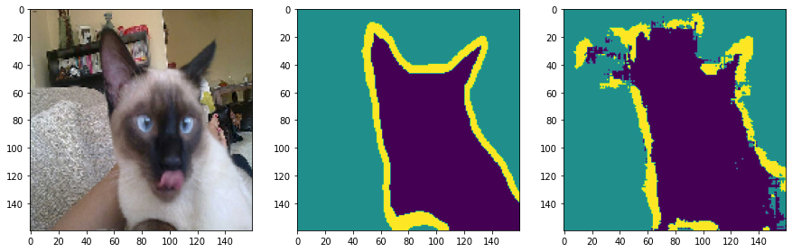
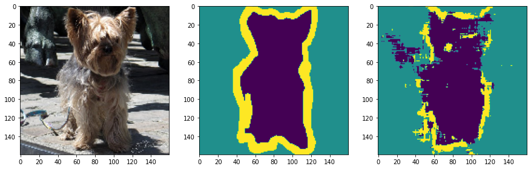
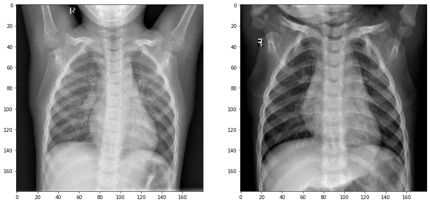

# IDEC Image Segmentation

Advanced Image Processing Lecture based on Deep Learning in **한국과학기술원 반도체설계교육센터 [(KAIST IDEC)](https://www.idec.or.kr/)**

**Pneumonia Classification and Pet Data Image Segmentation with U-Net**
 In 2021 Advanced Image Processing Lecture with KAIST IDEC

## DataSet

- Pet Data - 1190 Images (Ragdoll, saint_bernard, scottish_terrier, Siamese, staffordshire_bull_terrier, yorkshire_terrier) 
**[University of OXFORD : Open Dataset]** 
(https://www.robots.ox.ac.uk/~vgg/data/pets/data/images.tar.gz)
(https://www.robots.ox.ac.uk/~vgg/data/pets/data/annotations.tar.gz)

- Pneumonia Data - 1200 Images (Normal, Pneumonia) 
**[[Identifying Medical Diagnoses and Treatable Diseases by Image-Based : Open Dataset]](https://www.cell.com/cell/fulltext/S0092-8674(18)30154-5)**
(http://download.tensorflow.org/data/ChestXRay2017/train/images.tfrec)
(http://download.tensorflow.org/data/ChestXRay2017/train/paths.tfrec)

## Application

| Model | Loss Function | Optimizer | Epoch | Total Loss | Accuracy (Classification) (=F1-Score) | Dataset | Result | 
|:---:|:---:|:---:|:---:|:---:|:---:|:---:|:---:|
| U-Net | Sparse Categorical Crossentropy | RMSProp | 200 | 0.0269 (Train) | . | Pet Data | [Result_01](#Result_01) **(Segmentation)** |
| U-Net | Sparse Categorical Crossentropy | RMSProp | 1000 | 0.0041 (Train) | . | Pet Data | [Result_02](#Result_02) **(Segmentation)** |
| U-Net Leaky ReLU | Sparse Categorical Crossentropy | RMSProp | 1000 | 0.0048 (Train) | . | Pet Data | [Result_03](#Result_03) **(Segmentation)** |
| FCN | Binary Crossentropy | Adam | 200 | 1.0335 **(Test)**  | ***0.8650*** **(Test)** | Pneumonia Data | [Result_04](https://github.com/gh-BumsooKim/IDEC-Image-Segmentation/blob/main/05-TrainPneumoniaFCN.ipynb) **(Classification)** |
| FCN | MSE | Adam | 200 | ***0.1464*** **(Test)**  | 0.8500 **(Test)** | Pneumonia Data | [Result_05](https://github.com/gh-BumsooKim/IDEC-Image-Segmentation/blob/main/11-TrainPneumoniaFCN-MSE.ipynb) **(Classification)** |
| FCN | Binary Crossentropy | Nadam | 200 | 1.6821 **(Test)**  | 0.7500 **(Test)** | Pneumonia Data | [Result_06](https://github.com/gh-BumsooKim/IDEC-Image-Segmentation/blob/main/12-TrainPneumoniaFCN-Nadam.ipynb) **(Classification)** |
| FCN | Binary Crossentropy | AdaDelta | 200 | 0.3628 **(Test)**  | 0.8600 **(Test)** | Pneumonia Data | [Result_06](https://github.com/gh-BumsooKim/IDEC-Image-Segmentation/blob/main/13-TrainPneumoniaFCN-AdaDelta.ipynb) **(Classification)** |

 

#### Result_01

  

#### Result_02

  

#### Result_03

  

## Sample Dataset

### Sample Pet Train Raw Data (each different size)

   Siamese_203
  
 
   yorkshire_terrier_67
  

 

### Sample Pet Train Scaling Data (160 x 160 px)

   Siamese_203
  
 
   yorkshire_terrier_67
  

### Sample Pneumonia Train Scaling Data (180 x 180 px)

   Pneumonia
  
 

## Reference
https://keras.io/examples/vision/
